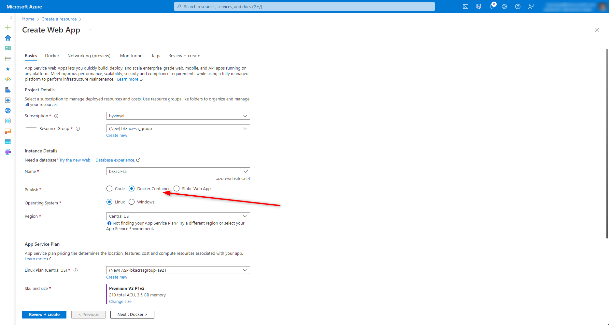
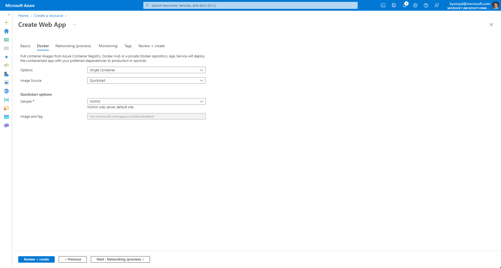
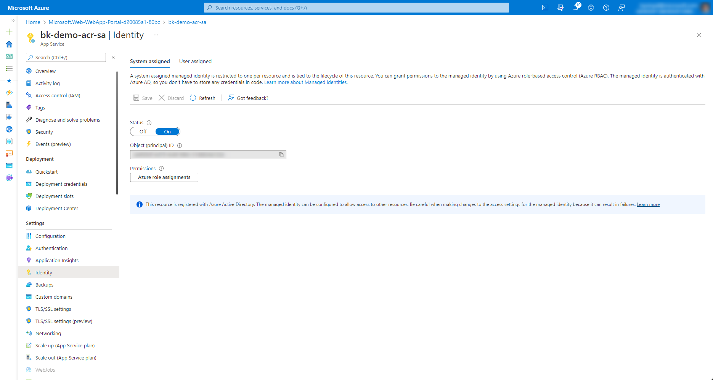
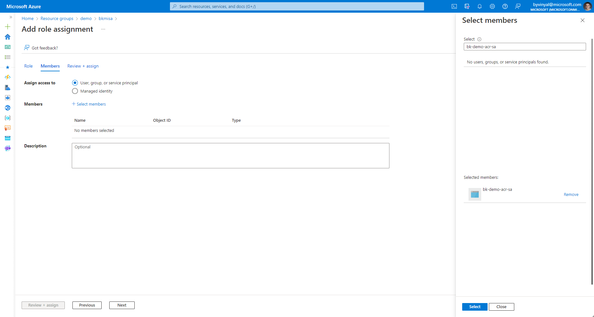
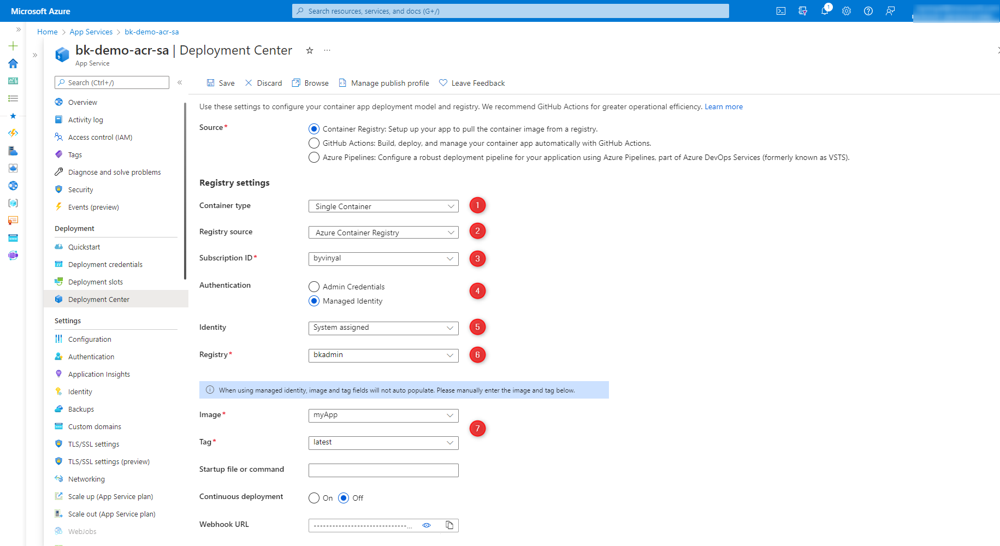

# How to use system-assigned Managed Identities with App Service and Azure Container Registry through the Azure Portal

> **NOTE**:
>
> - These instructions only apply to Linux based containers configurations.
> - The Azure Container registry must be internet accessible.
>   - Pulling container images through a Private Link / Private endpoint connection is currently **not supported**.

App Service can use **system-assigned** [managed identities](https://docs.microsoft.com/azure/active-directory/managed-identities-azure-resources/overview) to authenticate against **Azure Container Registry (ACR)** and perform `docker pull` operation.

Using **managed identities** is a best practice because they allow for the principle of _least privileged_ access to be followed compared to using the **admin** accounts.

## Prerequisites

This guide uses the [Azure Portal](https://portal.azure.com) to configure your resources. You should alreay have an Azure Container Registry (ACR) that your want to use. Learn more about [ACR](https://docs.microsoft.com/azure/container-registry/).

If you are starting with an empty ACR instance, you will need to [push an image into ACR](https://docs.microsoft.com/azure/container-registry/container-registry-get-started-docker-cli) so that you can later configure your app to use it in [STEP 3](#step-3-configure-webapp-to-pull-imagetag-from-acr).

## STEP 0 create your resources

You can create a web app in the azure portal [here](https://ms.portal.azure.com/#create/Microsoft.WebSite)

In the docker tab, we are going to stick to the quickstart image, we will change this later.

## STEP 1: Assign an identity to your WebApp

This step will configure the webapp to use a system-assigned identity. System-assigned identities are created on the fly and unlike 'service-principle' they don't require you to be a subscription level admin to create and use them.

In the portal navigate to your webapp and from the menu select **Identity** > **System Assigned** and set the status to **on**

## STEP 2: Grant access to the identity on ACR

This step will register the identity with ACR and grant it the minimum permission necessary for a webapp to pull and host containers from it.

Find your ACR in the portal and navigate to **Access Control (IAM)** and click on **Add Role Assignment**

Select the **ACPull** in the **Role** tab.

In the **Memebers** tab select **Assign access to User, group, or service principal**

Click on **+Select Memebers** and type in the name of your webapp. If you completed [Setp 1](#step-1-assign-an-identity-to-your-webapp) correctly you should be able to select and add the identity to the list.

Click on **Review + Assign** and complete the wizard to add the necesary permisions.

## STEP 3: Configure WebApp to pull image:tag from ACR

This step will configure the webapp to point to ACR and the Image:Tag for the container you want to use.

In the portal navigate to your webapp and from the menu select **Deployment Center** > **Settings**

Update the settings to match your scenario:

1. Set the container type to Single Container
1. Set the Registry Source to Azure Container Registry
1. Set the Subscription to match the subscription where your ACR instance is hosted.
1. Set Authentication to Managed Identity
1. Set the Identity to System Assigned
1. Select your ACR instance from the Registry dropdown
1. Provide the name of the image and tag for your app

