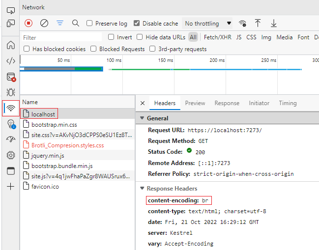

# Using GZIP and Brotli Compression With App Service Windows and .NET 6

Both Gzip and Brotli are data compression algorithms used to compress website files to make them smaller for faster client side loading. The tradeoff is greater CPU usage on the app side for running the compression algorithms. Both Brotli and GZIP can be used with App Service Windows.

## 1. Create A Windows App Service Plan & App

First, create a Windows App Service Plan & App. Using the Azure Portal, supply the following data: 

1. Subscription
2. Resource Group
3. Web App Name
4. Runtime Stack (.NET 6 in this case)
5. Operating System (Windows in this case)
6. Region
7. App Service Plan Name
8. SKU

## 2. Install IIS Compression Extension OR Set WEBSITE_ENABLE_BROTLI_ENCODING App Setting to true

After creating the app, we'll need to add the IIS Compression Extension or set the `WEBSITE_ENABLE_BROTLI_ENCODING` application setting to true. The [IIS Compression Extension](https://learn.microsoft.com/en-us/iis/extensions/iis-compression/iis-compression-overview) is required for Brotli Compression with IIS and optional for GZIP Compression.

To add the IIS.Compression Site Extension:

1. Navigate to **Extensions** under **Development Tools** in the left pane of your web app
2. At the top left of the Extensions page, click **Add**
3. Search for and install the **IIS.Compression Site Extension**

**OR**

To set the **WEBSITE_ENABLE_BROTLI_ENCODING** App Setting to true:

1. Navigate to **Configuration** under **Settings** in the left pane of your web app
2. Under Application settings, click **New application setting**
3. Set the name to **WEBSITE_ENABLE_BROTLI_ENCODING** and value to **true**


## 3. Create a .NET Web App

Follow the **Create an ASP.NET web app** section of the [App Service Quickstart for .NET](https://learn.microsoft.com/en-us/azure/app-service/quickstart-dotnetcore?tabs=net60&pivots=development-environment-vs) to create a sample web app.

## 4. Configure .NET 6 Application for GZIP & Brotli Compression

**Note:** There are multiple compression options available for both GZIP and Brotli Compression: 

1. CompressionLevel.Fastest gives the fastest response possible, even if not optimally compressed 
2. CompressionLevel.SmallestSize gives the smallest output possible, even if it takes longer to generate the compressed response
3. CompressionLevel.Optimal optimally compressed responses, even if the compression takes more time to complete

Modify the default `Program.cs` to configure GZIP and Brotli Compression using .NET 6. Full file contents below:

```csharp
using System.IO.Compression;
using Microsoft.AspNetCore.ResponseCompression;

var builder = WebApplication.CreateBuilder(args);

// Add services to the container.
builder.Services.AddRazorPages();

builder.Services.AddResponseCompression(options =>
{
    options.EnableForHttps = true;
    options.Providers.Add<BrotliCompressionProvider>();
    options.Providers.Add<GzipCompressionProvider>();
});

builder.Services.Configure<BrotliCompressionProviderOptions>(options =>
{
    // fastest response possible, even if not optimally compressed -- applies to GZIP as well
    options.Level = CompressionLevel.Fastest;
});

builder.Services.Configure<GzipCompressionProviderOptions>(options =>
{
    // smallest output possible, even if it takes longer -- applies to Brotli as well
    options.Level = CompressionLevel.SmallestSize;
});

var app = builder.Build();

// Configure the HTTP request pipeline.
if (!app.Environment.IsDevelopment())
{
    app.UseExceptionHandler("/Error");
    // The default HSTS value is 30 days. You may want to change this for production scenarios, see https://aka.ms/aspnetcore-hsts.
    app.UseHsts();
}

app.UseHttpsRedirection();
app.UseStaticFiles();
app.UseRouting();
app.UseResponseCompression();
app.UseAuthorization();
app.MapRazorPages();
app.Run();
```

## 5. Test App Locally

Running the app locally should produce the default .NET web app page. To ensure response compression is being applied, use the browser devtools to inspect the page. 

1. Right click the page and click **Inspect**
2. In the resulting window, select the **Network** tab
3. Reload the page and select the **localhost** document
4. Under **Response Headers**, the **content-encoding** field should show the type of compression your is using: br for Brotli and gzip for GZIP



## 6. Deploy to App Service

Using the same values as Step 1, follow the **Publish your web app** section of the [App Service Quickstart for .NET](https://learn.microsoft.com/en-us/azure/app-service/quickstart-dotnetcore?tabs=net60&pivots=development-environment-vs) to deploy your web app.

To ensure response compression is being applied, follow the same procedure from Step 5. 