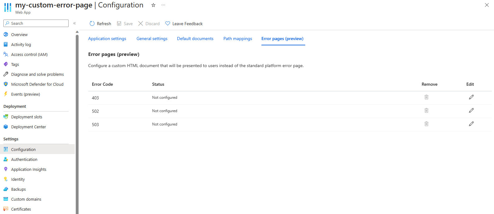
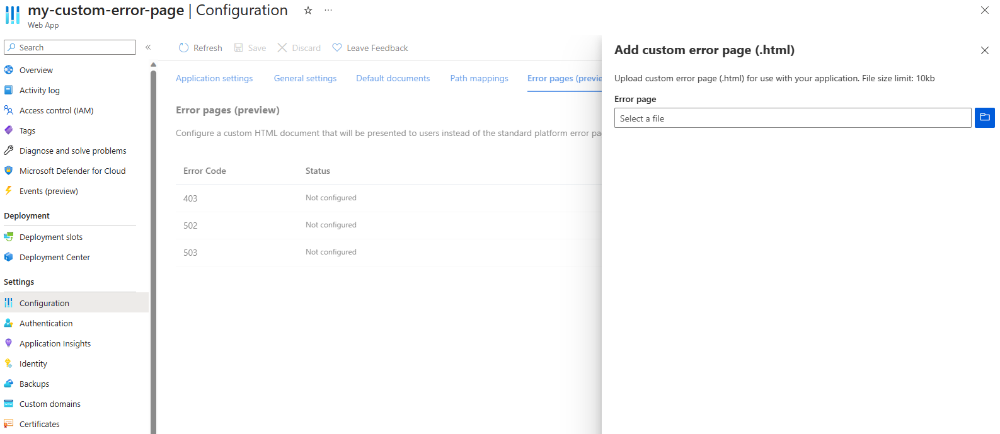
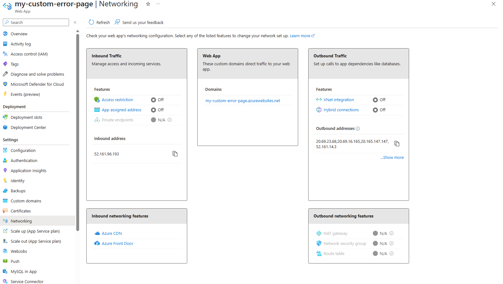
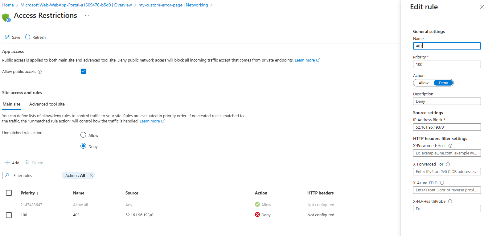
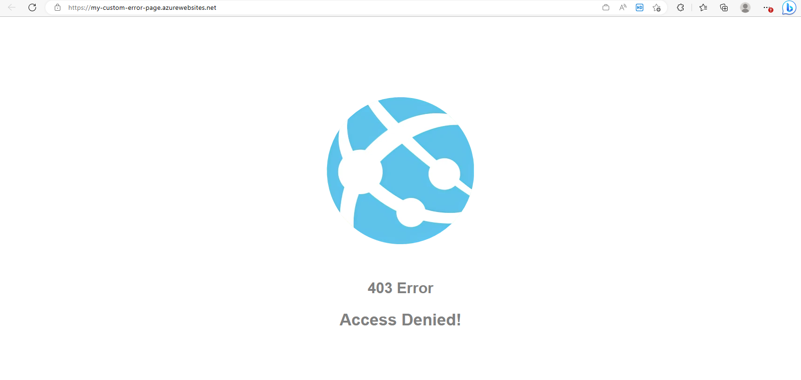

# How-to create a custom error page on App Service

App Service now enables the use of custom error pages for 403, 502, and 503 error codes so you can customize your users experience.  It's available for both Linux and Windows workloads using at least a Premium SKU.  The following is a tutorial on how to upload a custom error page to your Web App.

| Note: Custom error pages is not a supported feature on ASEv2 SKUs.

#### Prerequisite
In this tutorial, we'll be adding a custom error page to our web app hosted on App Service.  In order to accomplish this, you'll first need an html file that will serve as your error page that doesn't exceed a file size of 10kb.

#### Upload a custom error page
Once you have your html file prepared you can upload it to your web app.  In the configuration blade, you should see an **Error pages (preview) tab**.  Click on this tab to view the error page options.  If the options are greyed out, you'll need to upgrade to at least a Premium SKU to use this feature.

You'll see that there are 3 options for uploading a custom error page.  Choose the 403 error code by clicking the **Edit** button in the 403 row.  

Next, click on the **folder icon** to select your html file.  Remember the file must be in .html format and within the 10kb file size limit.

 Once the .html file is selected, click Upload.  You'll notice the status of the row changes from Not configured to Configured. Then click **Save**.

#### Set an IP restriction
Now that your 403 error page is uploaded, we should be able to trigger and view the error page.  Since this is a 403 access restriction error code, this can be triggered by setting an IP restriction.

To set an IP restriction, go to the **Networking blade** and click Access restriction under the **Inbound Traffic** card.

Under the **Site access and rules** section we can select the **+Add** button to create an IP restriction.

In the following form, you'll need to change the Action to **Deny**, fill out the **Priority** and **IP Address Block**.  In this example, we use the Virtual IP address that can be found in the web apps Overview blade under Networking and we're setting it to /0.  This will disable all public access when visiting the site. 

Once the Add rule form is filled out, select the **Add rule** button.  Then click **Save**.

Once saved, you'll need to restart the site for the changes to take affect.  Go to your overview page and select **browse**.  You should now see your custom error page load.

