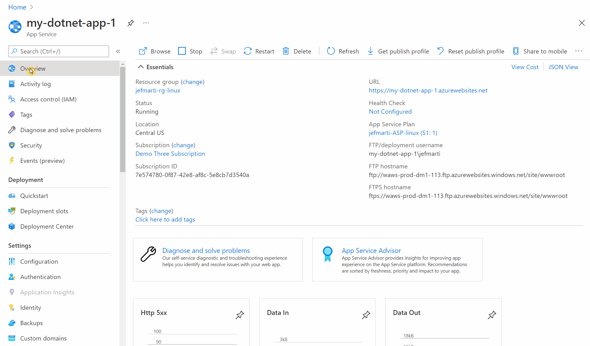

# .NET on App Service

## .NET Update Policy

App Service upgrades the underlying .NET runtime and SDK of your application as part of the regular platform updates. As a result of this update, your application will be automatically updated to the latest patch version available in the platform for the configured minor version of your app.

### End of Life

Once a version of .NET Core has reached it's end of life (EOL) it will no longer be available from Runtime Stack selection dropdown.

Existing applications configured to target a runtime version that has reached EOL should not be affected.

## Early Access limitations

During the early access period, apps will be subject to the **Early Access** limitations listed in the [early access support document](./early_access.md).

## Support Timeline

App Service updates existing stacks after they become available from each community. Please reffer to the official [.NET Support timeline](https://dotnet.microsoft.com/platform/support/policy/dotnet-core) for the most up to date version support information

## How to update your app to target a different version of .NET or .NET Core

> **NOTE**:
> Changing the stack settings of your app will trigger a re-start of your application.

Update your App Service apps to use a supported version of .NET or .NET Core in the Azure portal:

1. In the Azure portal, click the **App Service** blade. Select the app you want to update. 
2. In the Configuration panel, click the **General settings** tab.
3. Under Stack Settings, click the drop-down menu under **Major version** and select the .NET or .NET Core version you want (we recommend choosing the most recent version).
4. Click **Save**.

