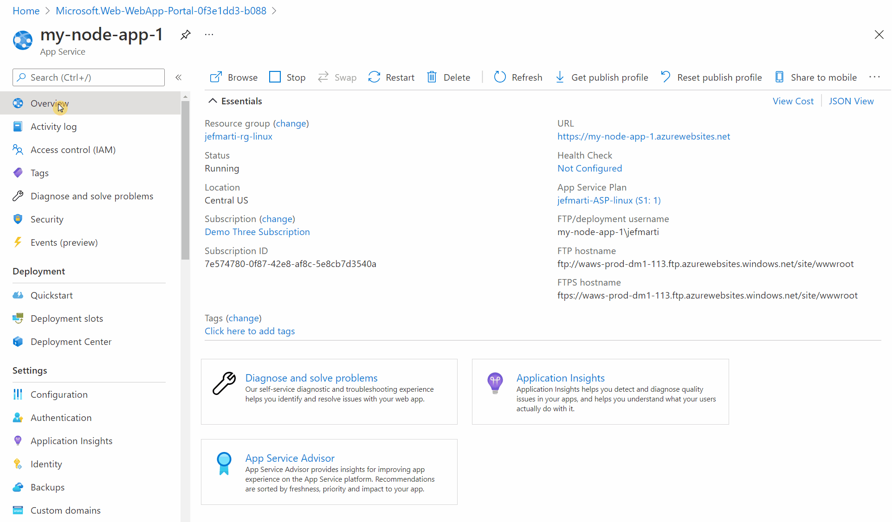

# Node.js on App Service

## Node.js Update Policy

App Service upgrades the underlying Node.js runtime and SDK of your application as part of the regular platform updates. As a result of this update process, your application will be automatically updated to the latest patch version available in the platform for the configured runtime of your app.

### Node 12 LTS End of Official Support

Once a version of Node has reached it's end of support no new critical or security fixes will be available.

On April 30th, 2022 Node 12 will no longer be offered as an option in the create process for App Service. Existing apps targeting Node 12 will not be affected.  We recommend migrating your application to Node 14 LTS.  See our guidance [below](#how-to-update-your-app-to-target-a-different-version-of-node) to target a new version.

### End of Life

Once a version of Node.js has reached it's end of life (EOL) it will no longer be available from Runtime Stack selection dropdown.

Existing applications configured to target a runtime version that has reached EOL should not be affected.

## Support Timeline

|    Version    | Support Status |   End of Support  |   OS Support    |
|---------------| -------------- | ----------------- |---------------- |
|  Node.js 8.x  | End of Life    | December 31 2019  | Windows & Linux |
|  Node.js 9.x  | End of Life    | June 30 2019      | Windows & Linux |
|  Node.js 10.x | End of Life    | April 30 2021     | Windows & Linux |
|  Node.js 12.x | Active LTS     | April 30 2022     | Windows & Linux |
|  Node.js 14.x | Active LTS     | April 30 2023     | Windows & Linux |

[Node.js support timeline](https://nodejs.org/about/releases/)

## How to update your app to target a different version of Node

>**NOTE**:
>Changing the stack settings of your app will trigger a re-start of your application.

Update your App Service apps to use a supported version of Node in the Azure portal:
1. In the Azure portal, click the **App Service** blade. Select the app you want to update. 
2. In the Configuration panel, click the **General settings** tab.
3. Under Stack Settings, click the drop-down menu under **Major version** and select the Node version you want (we recommend choosing the most recent version).
4. Click **Save**.

