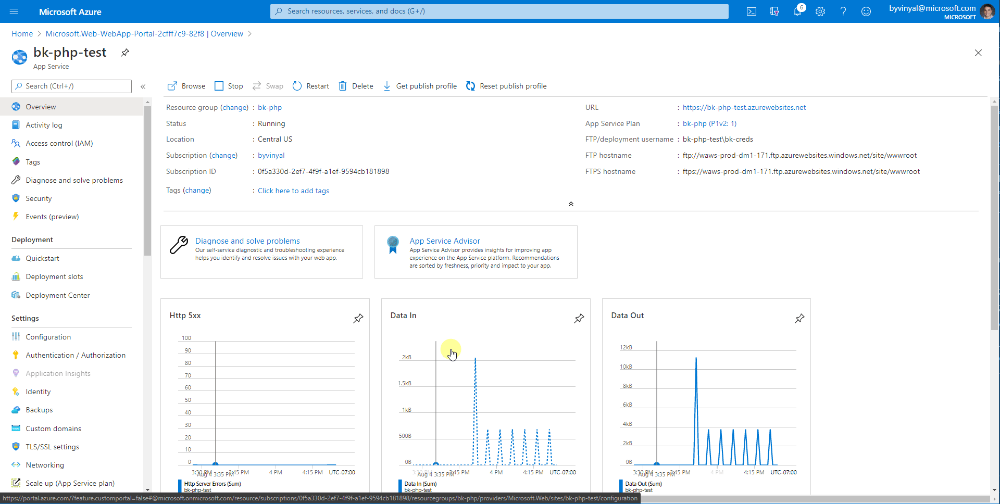

# PHP on App Service

## PHP Update Policy

App Service upgrades the underlying PHP runtime of your application as part of the regular platform updates. As a result of this regular update process, your application will be automatically updated to the latest patch version of PHP available in the platform.

### End of Extended Support

Once a version of PHP has reached it's end of extended support your application will be upgraded to the next recommended supported minor version.

For example on February 01, 2020 any application running on `PHP 7.0`  or `PHP 7.1` will be upgraded to `PHP 7.3`

### End of Life for PHP 5.6

Due to the popularity of **PHP 5.6** and the high volume of applications hosted using this version of the PHP runtime, critical security fixes have been actively backported from the 7.X PHP branch into the version of **PHP 5.6** provided by **Azure App Service**.

Extended support for this version of **PHP 5.6** will end on **February 01, 2021**. At this point any application hosted in App Service targeting this version of the **PHP 5.6** will be out of support and at risk of security vulnerabilities that remain unpatched.

### End of Life for PHP 7.4

Extended support for **PHP 7.4** will end on **November 28, 2022**. After this date, your applications will continue to run, however any application hosted in App Service targeting **PHP 7.4** will be out of support and at risk of security vulnerabilities that remain unpatched.

**If you are currently targeting Windows for PHP development, we advise to plan for migrating development to target Linux. After November 28 2022, Linux will be the only OS supported by future version of PHP and continued feature, quality and security updates**.

## PHP 8

The next version of PHP is expected to be [PHP 8.0](https://wiki.php.net/todo/php80). Official support for PHP 8 will only be available on Linux, as a result of this App Service will only support PHP 8 on Apps Service Linux instances.

## Support Timeline

| Version |  Support Status  |  End of Official Support | End of Extended Support | OS Support |
|---------| ---------------- |:------------------------:|:-----------------------:| ---------- |
| PHP 5.6 | Extended Support |    January 01, 2019      |    February 01, 2021    | Windows & Linux |
| PHP 7.0 | End of Life      |    December 03, 2018     |    February 01, 2020    | Windows & Linux |
| PHP 7.1 | End of Life      |    December 01, 2019     |    February 01, 2020    | Windows & Linux |
| PHP 7.2 | Official Support |    November 30, 2020     |    February 01, 2021    | Windows & Linux |
| PHP 7.3 | Official Support |    December 06, 2020     |    December 06, 2021    | Windows & Linux |
| PHP 7.4 | Official Support |    November 28, 2021     |    November 28, 2022    | Windows & Linux |
| PHP 8.x | TBD              |    TBD                   |    TBD                  | Linux only |

[PHP Official Support timeline](https://www.php.net/supported-versions.php)

## How to update your app to target a different version of PHP

>**NOTE**:
>
>Changing the stack settings of your app will trigger a re-start of your application.

Update your App Service apps to use a supported version of PHP in the Azure portal:
1. In the Azure portal, click the **App Service** blade. Select the app you want to update. 
2. In the Configuration panel, click the **General settings** tab.
3. Under Stack Settings, click the drop-down menu under **Minor version** and select the PHP version you want (we recommend choosing the most recent version).
4. Click **Save**.

