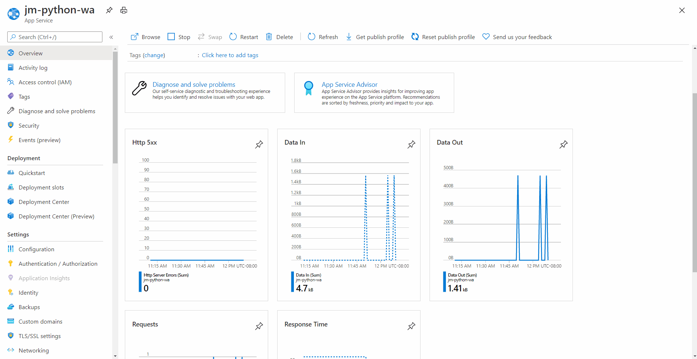

# Python on App Service

## Python Update Policy

App Service upgrades the underlying Python runtime of your application as part of the regular platform updates. As a result of this regular update process, your application will be automatically updated to the latest patch version of Python available for that platform.

### Python 2.7 End of Official Support

Once a version of Python has reached it's end of support no new critical or security fixes will be available.

On February 2, 2020 Python 2.7 will no longer be offered as an option in the create process for App Service. Existing apps targeting Python 2.7 will not be affected.

### Python 3.6 End of Official Support

Once a version of Python has reached it's end of support no new critical or security fixes will be available.

On December 23rd, 2021 Python 3.6 will no longer be offered as an option in the create process for App Service. Existing apps targeting Python 3.6 will not be affected.

> **If you are currently targeting Windows for Python development you have the option to use a [Windows container](https://azure.github.io/AppService/2021/03/04/How-to-Host-a-Python-application-with-Windows-Containers-on-App-Service.html) going forward, however we recommend you plan for migrating development to target Linux.  After December 23 2021, Linux will be the only OS supported by future versions of Python and continued feature, quality and security updates. Once your application is refactored to target Linux, follow the QuickStart documentation for [deploying a Python app using App Service on Linux](https://docs.microsoft.com/azure/app-service/quickstart-python?tabs=bash&pivots=python-framework-flask)**

### Python 3.7 End of Official Support

Once a version of Python has reached it's end of support no new critical or security fixes will be available.

On June 27th, 2023 Python 3.7 will no longer be offered as an option in the create process for App Service. Existing apps targeting Python 3.7 will not be affected.  We recommend migrating your application to Python 3.8.  See our guidance [below](#how-to-update-your-app-to-target-a-different-version-of-python) to target a new version.

### Python on Windows End of Official Support
Python on Windows App Service has been unsupported since December 23, 2021 with the end of support for Python 3.6. After that date, Linux has been the only supported OS for Python versions going forward and Python apps using Windows no longer receive security patches or customer service. If you have Python on Windows applications, we strongly urge you to update your apps to a supported version of Python on Linux or migrate your application to use a Windows container.

See the available options to migrate your Python apps below:
- Follow the quickstart documentation to deploy a [Python app using Linux App Service](https://docs.microsoft.com/azure/app-service/quickstart-python?tabs=bash&pivots=python-framework-flask)
- Follow the instructions for hosting a Python app using a [Windows container](https://azure.github.io/AppService/2021/03/04/How-to-Host-a-Python-application-with-Windows-Containers-on-App-Service.html)

## Support Timeline

|  Version    |  Support Status  |  End of Official Support |    OS Support   |
|-------------| ---------------- |:------------------------:|:---------------:|
| Python 3.12 | Active Support   |    October 31, 2028      | Linux           |
| Python 3.11 | Security Support |    October 31, 2027      | Linux           |
| Python 3.10 | Security Support |    October 31, 2026      | Linux           |
| Python 3.9  | Security Support |    October 31, 2025      | Linux           |
| Python 3.8  | Security Support |    October 31, 2024      | Linux           |
| Python 3.7  | EOL              |    June 27, 2023         | Linux           |
| Python 3.6  | EOL              |    December 23, 2021     | Windows & Linux |
| Python 2.x  | EOL              |    January 01, 2020      | Windows & Linux |

[Python Official Support timeline](https://devguide.python.org/#status-of-python-branches)

[Python 2.x Official Support timeline](https://www.python.org/doc/sunset-python-2/)

## How to update your app to target a different version of Python

>**NOTE**:
>Changing the stack settings of your app will trigger a re-start of your application.

Update your App Service apps to use a supported version of Python in the Azure portal:

1. In the Azure portal, click the **App Service** blade. Select the app you want to update. 
2. In the Configuration panel, click the **General settings** tab.
3. Under Stack Settings, click the drop-down menu under **Minor version** and select the Python version you want (we recommend choosing the most recent version).
4. Click **Save**.

