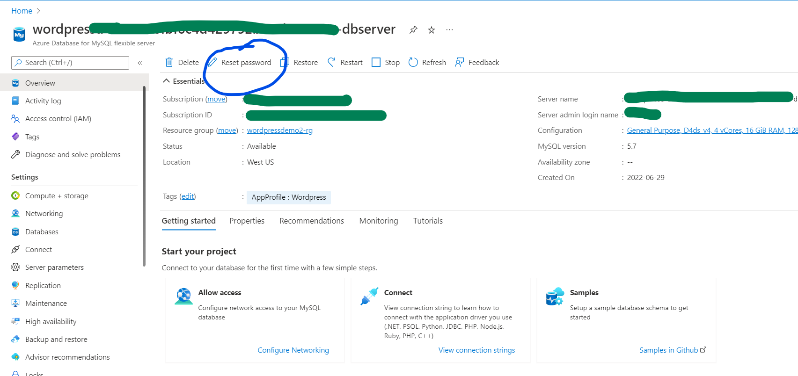
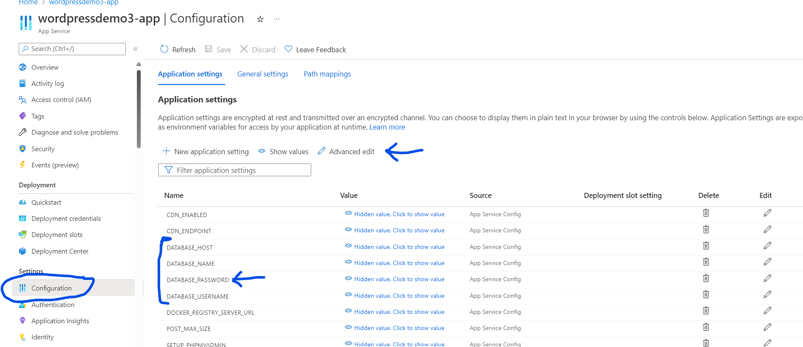
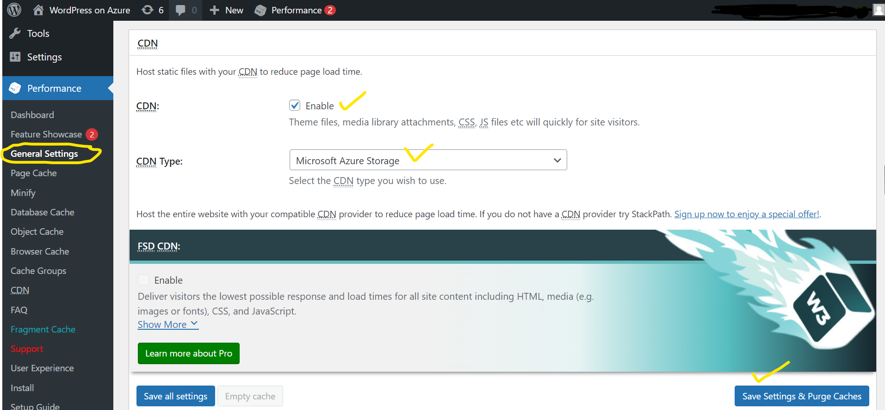
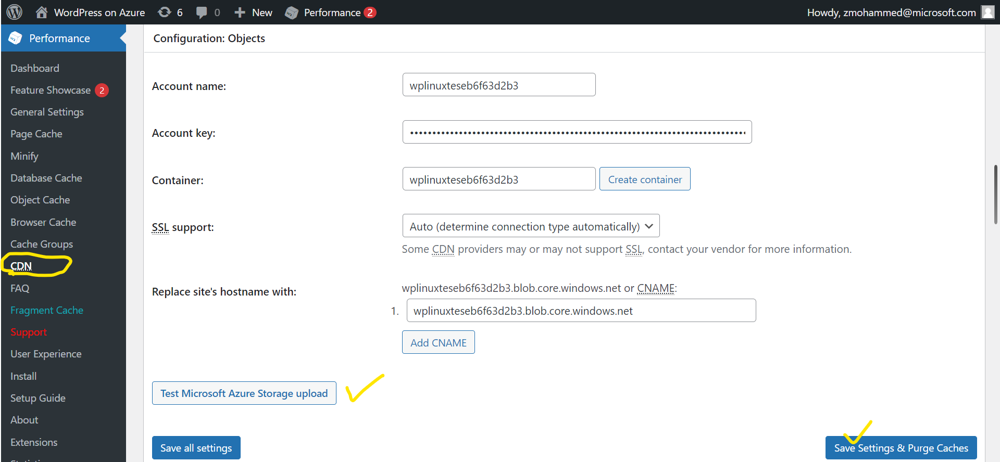

# Changing MySQL database password

WordPress deployment creates an AppService and a MySQL flexible database server under the same resource group. Login credentials for the MySQL server are generated randomly during deployment process. 
 
These database connection details are configured into WordPress via **Application Settings** option available in the AppService. You can retrieve the database connection details from Application Setting section in case you forgot to note them down during the creation time. 

Please note that the Application Settings related to database connection are **persistent** during the entire lifetime of your WebApp. Any changes to these settings will reflect the same in your WordPress application.

|    Application Setting Name    |
|--------------------------------|
|    DATABASE_NAME               |
|    DATABASE_HOST               |
|    DATABASE_USERNAME           |
|    DATABASE_PASSWORD           |

### Changing MySQL Database Password

First, go to the MySQL resource corresponding to your WordPress deployment, and click on **Reset Password** option as shown below. Now enter the new password and click on Save. Wait until the action is completed. 

Then navigate to the Configuration section of your AppService and update the **DATABASE_PASSWORD** Application Settings in your AppService. Once you update the value, click on Save and wait for app to get restarted. 

 
<kbd></kbd> 
<kbd></kbd>

Blob Storage has retention policy enabled which allows to restore deleted blobs/containers up to 7 days after being deleted. By default, Blob Storage supports only HTTPS protocol. In case support for HTTP is required, this option can be changed in Storage Account settings in the Azure Portal at **Storage Account -> Settings -> Configuration**. 

The following Application Settings are passed on to the Web App during the deployment in order to configure Azure Blob Storage usage in WordPress. Please note that these settings are only used as a 'one-time' reference during the deployment time and any subsequent change to these settings later on will not update the same in WordPress.

|Application Settings|
|--------------------|
|BLOB_STORAGE_ENABLED|
|STORAGE_ACCOUNT_NAME|
|STORAGE_ACCOUNT_KEY |
|BLOB_CONTAINER_NAME |

## Miscellaneous Information
- Blob Storage is configured with WordPress using **W3 Total Cache** plugin and its settings can be seen in the CDN tab of the plugin's settings. In this tab, it is not recommended to change settings to host wp-includes/ files, theme files or other non-Media files that are not in wp-content/uploads folder. Enabling these settings will change these files' URL that point to Blob Storage and this can lead to issues if the files are not present in Blob Storage (which usually would be the case since non-Media files are not spontaneously uploaded to Blob Storage).

- Storage Account settings are defined in W3 Total Cache CDN tab. Storage Account Key can be visible to Administrators.  Azure Blog Storage container setting is set to ‘public, read-only’  blob access.

- In case Blob Storage needs to be disabled, then in addition to disabling CDN in W3Total Cache settings, files from Blob Container need to be moved to wp-content/uploads folder in AppService if not already present.

- If Custom Domain or CDN is enabled for Blob Storage, then the domain name needs to be updated in **'Configuration -> Replace site's hostname with'** setting in W3 Total Cache CDN settings.

- Azure Blob Storage currently doesn't support SSL with custom domain. Click here for more information on custom domain mapping to Azure Blob Storage.

**Reference Links:** 
[Introduction to Azure Blob Storage](https://docs.microsoft.com/en-us/azure/storage/blobs/storage-blobs-introduction) 
[Storage account overview - Azure Storage | Microsoft Docs](https://docs.microsoft.com/en-us/azure/storage/common/storage-account-overview#performance-tiers) 
[W3 Total Cache – WordPress plugin | WordPress.org](https://wordpress.org/plugins/w3-total-cache/)  

 
<kbd></kbd>
<kbd></kbd>
<kbd></kbd>
