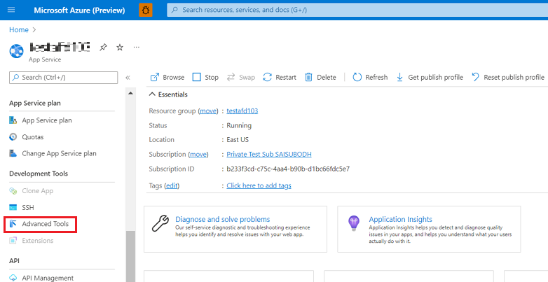
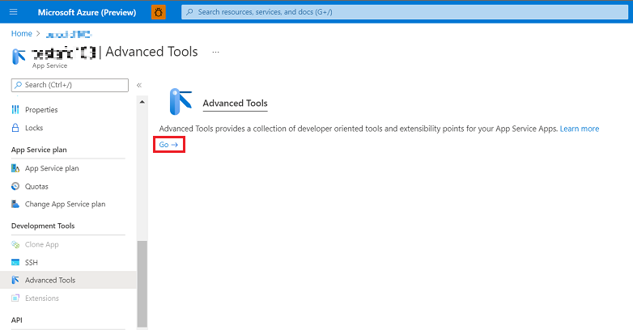
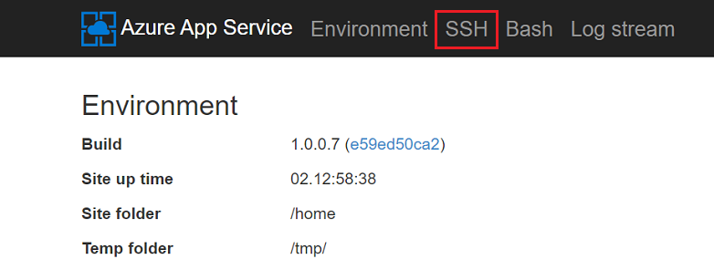
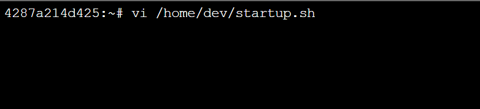

# Running Start-up Scripts on WordPress Linux App Services

Start-up commands or script can be added to a pre-defined bash shell file **(/home/dev/startup.sh)** which is executed after the webapp container starts.

App Service architecture inherently has non persistent storage for files outside **/home** directory where all file updates are lost after app restarts and reverted to the original state. A majority of config files are stored in /etc directory and start-up script can be used to edit these non-persistent files. Since the start-up script is executed after each app start-up, the edited changes made would persist after restarts or on scaling out of the app service.

Please make sure the start-up script is tested properly (preferably in a test deployment slot of your app service).

 

Navigate to **WebSSH/Bash** shell in scm portal of your WordPress App. You can access the SCM site either from Azure Protal or using the following URL **https://\<sitename\>.scm.azurewebsites.net/newui**

<kbd></kbd> 
 

<kbd></kbd> 
 

<kbd></kbd> 
 

Add your start-up commands to **/home/dev/startup.sh** file. And restart your app for the changes to get reflected.
<kbd></kbd> 

