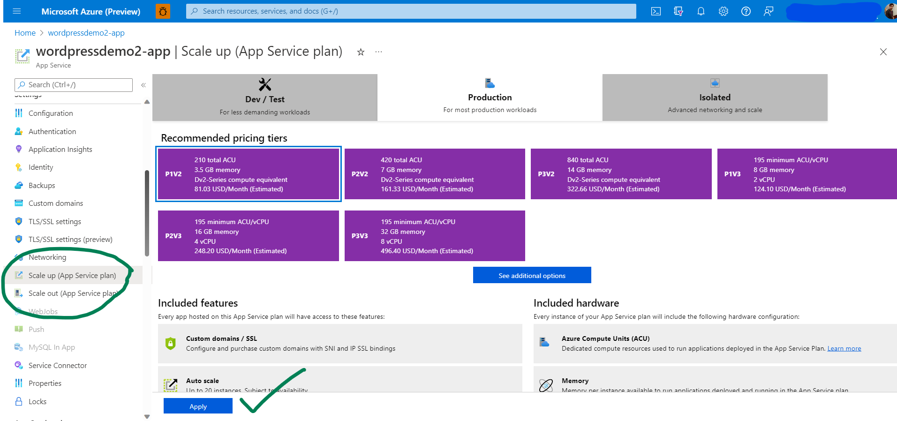
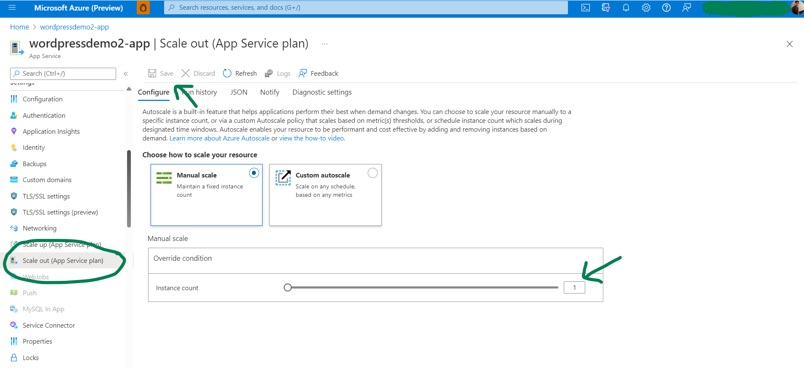
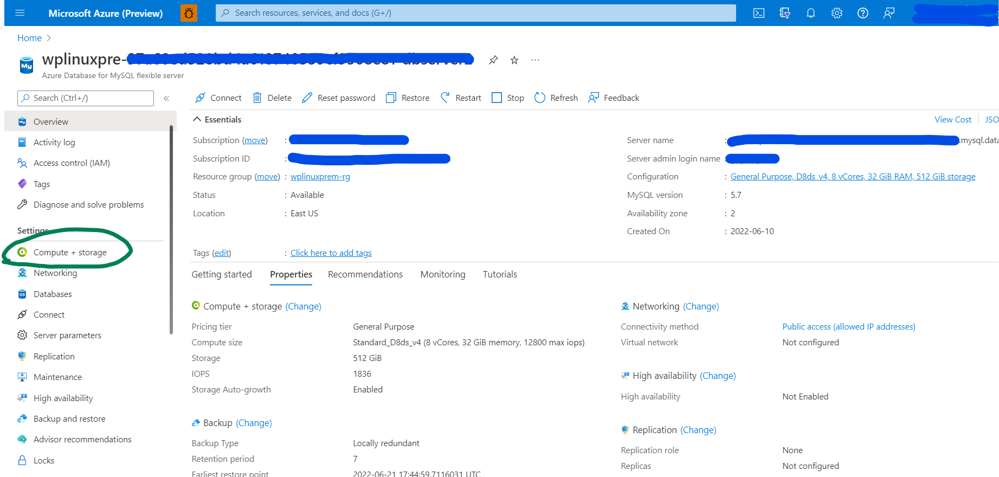
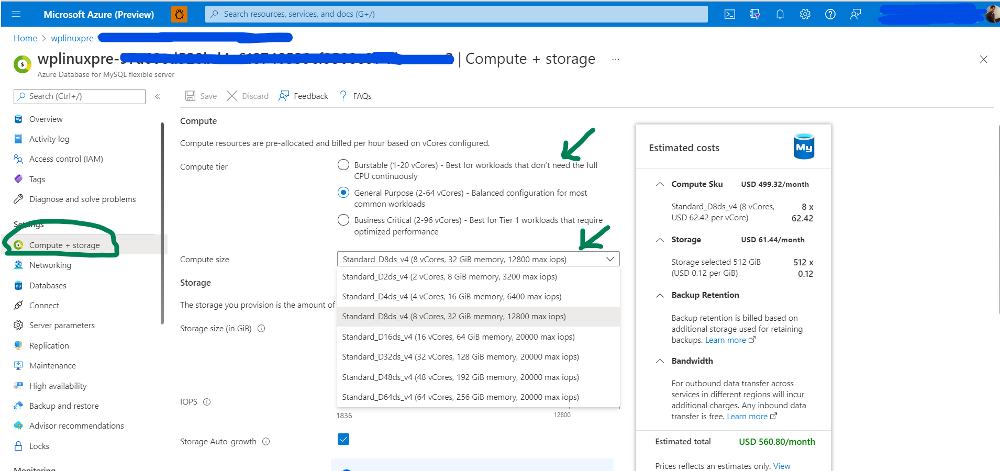

# Hosting Plans and Scaling WordPress

## Hosting Plans Offered

For a quick start, three types of hosting plans are made available for WordPress on Linux AppServices. These plan dictates what resources are available, what features are enabled and how it is priced. Each hosting plans comes with a pre-defined configuration for AppService and MySQL database server. 

| Hosting Plan | WebApp | Database (MySQL Flexible Server) |
|--------------|--------|----------------------------------|
|Basic|	B1 (1 vCores, 1.75 GB RAM, 10 GB Storage)|	Burstable, B1ms  (1 vCores, 2 GiB RAM, 32 GiB storage, 400 IOPS)|
|Standard|	P1V2 (1 vCores, 3.5 GB RAM, 250 GB Storage)|	General Purpose, D2ds_v4  (2 vCores, 8 GiB RAM, 128 GiB storage, 700 IOPS)|
|Premium|	P1V3 (2 vCores, 8 GB RAM, 250 GB Storage)|	Memory Optimized, Standard_E2ds_v4   (2 vCores, 16 GiB RAM, 256 GiB storage, 1100 IOPS)|

 

## Scaling WordPress
Although fixed hosting plans are offered during the create time, the users are free to scale their resources once the WordPress deployment is complete, based on their requirement.

**Important Note:** It is very important to note that both AppService as well as MySQL server has to be scaled appropriately. Upgrading AppService to a higher configuration, but forgetting to upgrade database server might create performance issues due to bottleneck created by lower configuration of database server. This has been observed as one of the common mistake users make while scaling their application.

### 1. Scaling AppService Plan:
There are two workflows for scaling your application, scale up and scale out. Please refer to the following link for more information on [Scaling AppService](https://docs.microsoft.com/en-us/azure/app-service/manage-scale-up). 

[**Scale up:**](https://en.wikipedia.org/wiki/Scalability#Vertical_or_scale_up) Get more CPU, memory, disk space, and extra features like dedicated virtual machines (VMs), custom domains and certificates, staging slots, autoscaling, and more. You scale up by changing the pricing tier of the App Service plan that your app belongs to.  
<kbd></kbd>

[**Scale out:**](https://en.wikipedia.org/wiki/Scalability#Horizontal_or_scale_out) Increase the number of VM instances that run your app. You can scale out to as many as 30 instances, depending on your pricing tier. 

<kbd></kbd>

### 2. Scaling MySQL Database Server:
Go to the MySQL server resource and select **Compute + storage** under **Settings** section. Select an appropriate tier for scaling and then click on save. It usually takes a few minutes for the changes to get reflected. You can find the MySQL server resource in the same resource group where WordPress has been deployed.

<kbd></kbd>
<kbd></kbd>
