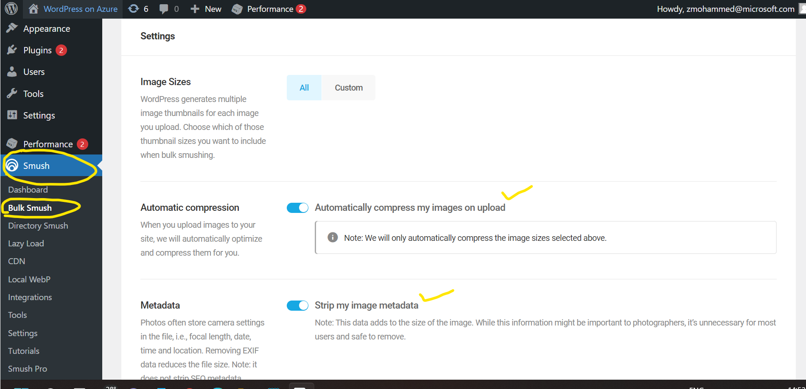
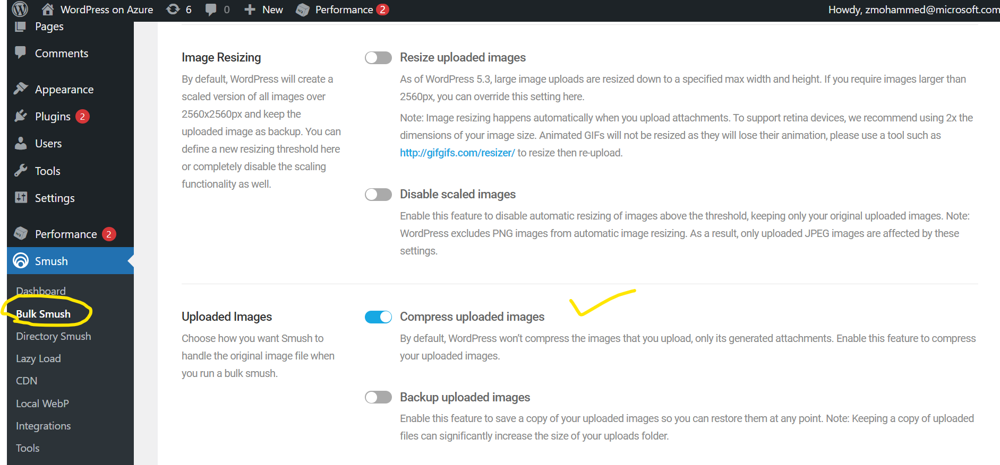

# Image Optimizations in WordPress
A pre-installed and activated **Smush It** plugin is provided with the offering for image compressions and optimizations. When you upload images to your site, it will automatically optimize and compress them for you.

**Note:** Lazy Loading feature is provided by default in WordPress, and is therefore not enabled in Smush.
[Smush – Lazy Load Images, Optimize & Compress Images – WordPress plugin | WordPress.org](https://wordpress.org/plugins/wp-smushit/)

 
<kbd></kbd>
<kbd></kbd>