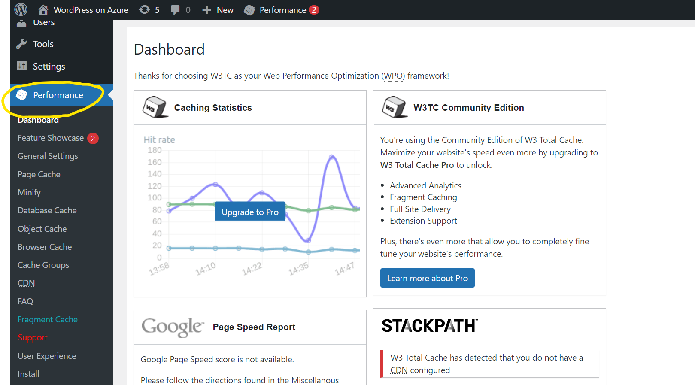
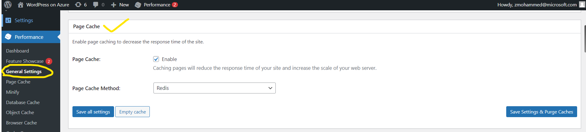
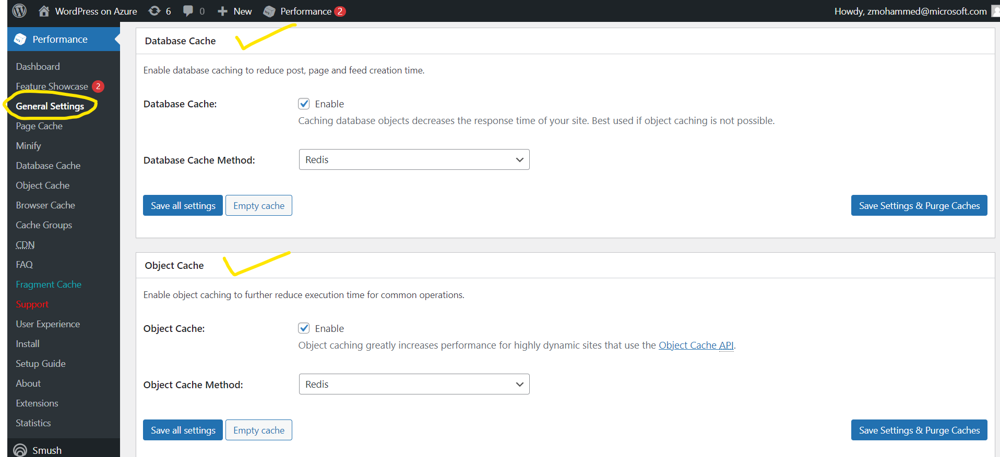
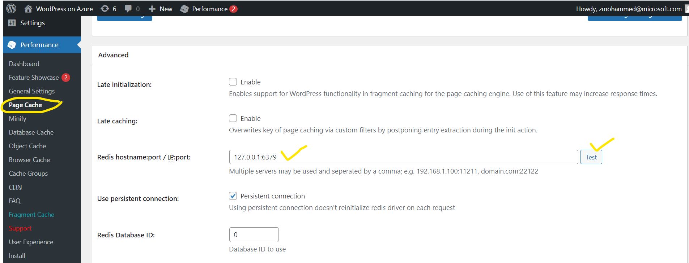
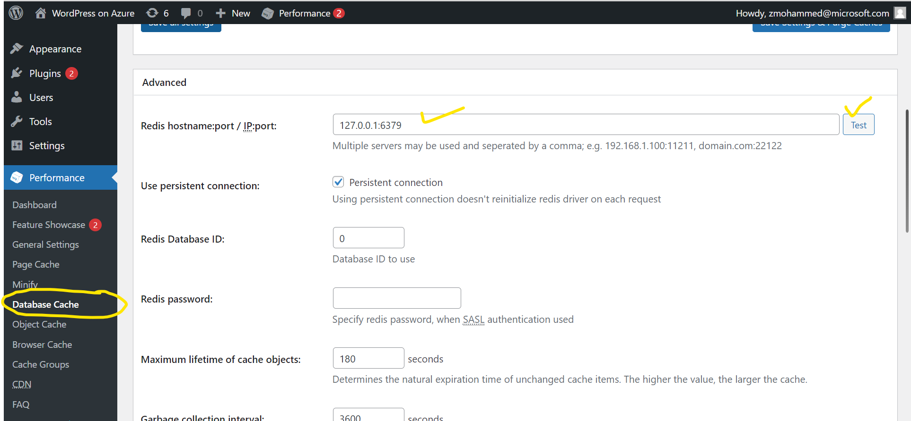
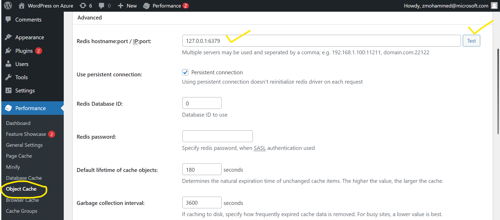

# Configuring Local Redis Cache in WordPress

The WordPress on Linux App Service has a local Redis Server installed and running on **127.0.0.1:6379**. Redis server is configured to use at most 20% of the total available memory. It is recommended to utilize this caching to reduce the load on the App Service and database.

By default, WordPress is configured to use Redis server cache using the **W3 Total Cache** plugin. There are four types of caches that can be configured using this plugin.
1. Page Cache
2. Object Cache
3. Database Cache
4. Fragment Cache (only for premium users of W3TC plugin)

Please see the images below for manual configuration and usage of Redis Cache.  Note that you have to click on either **Save Settings** or **Save Setting & Purge Cache** button of each section after entering the configurations. 

**Reference Links:**
[W3 Total Cache – WordPress plugin | WordPress.org](https://wordpress.org/plugins/w3-total-cache/)

 
<kbd>

</kbd>