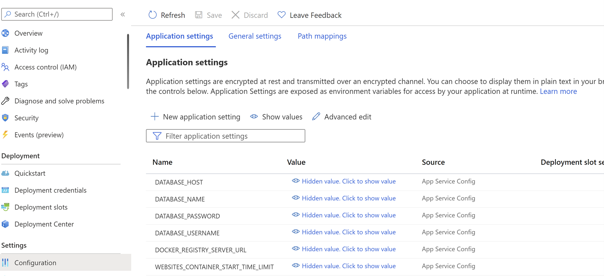

# WordPress Migration to Linux App Service

This document describes two different approaches to migrating your WordPress sites from any hosting provider to Azure Linux App Services. These migration approaches will let you continue with the existing WordPress site as it is. It is recommended to transition the traffic to the new site after proper validation.

**Note:** Migrate the content to a test instance first, validate all E2E scenarios of your website, and if everything works as expected, swap this instance to the production slot.
 

## 	1. All-In-One WP Migration Plugin

This is a very popular and trusted plugin used for migrating sites with ease and is also recommended by the Azure WordPress team. However, there are certain things that need to be taken care of before starting on the WordPress migration.


This approach is recommended for smaller sites where the content size is less than 256MB. If it is more, you can either **purchase the premium version** of the plugin, which allows you to bypass the file upload limit, or you can **manually migrate** the site using the steps outlined in the next section.


By default, the file upload size for WordPress on Linux App Services is limited to 50MB, and it can be increased up to 256MB (Maximum Limit). To change the file upload size limit, you need to add the following Application Settings in the App Service and save it.


|    Application Setting Name    | Default Value | New Value   |
|--------------------------------|---------------|-------------|
|    UPLOAD_MAX_FILESIZE         |      50M      |   256M      |
|    POST_MAX_SIZE               |      128M     |   256M      |


If you choose to migrate the site using this plugin, install All-In-One Migration plugin on both source and target sites.

### Export the data at source site: 
1.	Launch WordPress Admin page
2.	Open All-In-One WP Migration plugin
3.	Click on 'Export' option and specify the export type as file
4.	This bundles the contents of database, media files, plugins, and themes into a single file, which can then be downloaded.

### Import the data at destination site: 
1.  Launch WordPress Admin page
2.	Open All-In-One WP Migration plugin
3.	Click on import option on the destination site, and upload the file downloaded in previous section
4.	Empty the caches in W3TC plugin (or any other caches) and validate the content of the site.
    - Click on the **Performance** option given in the left sidebar of the admin panel to open the W3TC plugin.
    - Then click on the **Dashboard** option shown below it.
    - On the dashboard, you will see a button with the label **Empty All Caches**.


### Recommended Plugins:
Usually it is not required, but after the site migration, it is better to validate that you have the default recommended plugins activated and configured properly as before. If you are strictly bound to not using them, then you can remove the plugins.

- The W3TC plugin should be activated and configured properly to use the local Redis cache server and Azure CDN/Blob Storage (if it was configured to use them originally). For more information on how to configure these, please refer to the following documentations:<br> [Local Redis Cache](./wordpress_local_redis_cache.md), [Azure CDN](./wordpress_azure_cdn.md), [Azure Blob Storage](./wordpress_azure_blob_storage.md).

- WP Smush plugin is activated and configured properly for image optimization. Please see [Image Compression](./wordpress_image_compression.md) for more information on configuration.


### Recommended WordPress Settings:
The following WordPress settings are recommended. However, when the users migrate their custom sites, is it up to them to decide whether to use these settings or not.

1. Open the WordPress Admin dashboard.
2. Set the permalink structure to 'day and name', as it performs better compared to the plain permalinks that uses the format **?p=123**.
3. Under the comment settings, enable the option to break comments into pages.
4. Show excerpts instead of the full post in the feed.
<br>

## 2. Manual Migration Process
The prerequisite is that the WordPress on Linux Azure App Service must have been created with an appropriate hosting plan from here: [WordPress on Linux App Service](./https://portal.azure.com/#create/WordPress.WordPress).


### Export the data at source site: 
1. Download the **wp-content** folder from the source site. You can use popular FTP tools like [FileZilla](https://filezilla-project.org/download.php?type=client) to connect to the web server and download the content. Depending on the size of your content, it could take sometime. Meanwhile, you can go to the next step to download a copy of your database. 

2. Export the contents of the source database into an SQL file. You can perform this task either using MySQL client tools like HeidiSQL, MySQL workbench, PhpMyAdmin or through command line interface. You can download the MySQL Workbench from [here](https://dev.mysql.com/downloads/workbench/) or install phpmyadmin using these [steps](https://docs.phpmyadmin.net/en/latest/setup.html). For more information on exporting the database, please refer to the following [documentation](https://dev.mysql.com/doc/workbench/en/wb-admin-export-import-management.html).

### Import the data at destination site: 
1. Go to SCM site of your WordPress App Service using the following URL.
    ````
    https://<sitename>.scm.azurewebsites.net/newui 
    ````
2. Open Bash Shell from the menu shown on the left side.
3. Delete the existing content of **/home/site/www/wp-content** folder using the following command.
    ````
    rm -rf /home/site/www/wp-content/* 
    ````
4. Now upload the new contents of **wp-content** folder using the File Manager. Click on the label that says '**Drag a File/Folder here to upload, or click to select one**'. Please note that if you are not able to upload everything at once, then you can try dividing your upload into multiple smaller ones.

5. Import the SQL file downloaded from the source database into the database of your newly created WordPress site. You can do it via the PhpMyAdmin dashboard available at **\<sitename\>.azurewebsites.net/phpmyadmin**. Please note that if you are unable to one single large SQL file, please try to break it into multiple smaller parts and try uploading. Steps to import the database through phpmyadmin are described [here](https://docs.phpmyadmin.net/en/latest/import_export.html#import).

6. Launch the Azure Portal and navigate to your **App Service -> Configuration** blade. Update the database name in the **Application Settings** of App Service and save it. This will restart your App and the new changes will get reflected.

    |    Application Setting Name    | Update Required?                         |
    |--------------------------------|------------------------------------------|
    |    DATABASE_NAME               |      Yes, replace with the source (exported) database name |
    |    DATABASE_HOST               |      Not Required                        |   
    |    DATABASE_USERNAME           |      Not Required                        |   
    |    DATABASE_PASSWORD           |      Not Required                        |

    Reference: [WordPress Application Settings](./wordpress_application_settings.md)

    


### Recommended Plugins:
Usually it is not required, but after the site migration, it is better to validate that you have the default recommended plugins activated and configured properly as before. If you are strictly bound to not using them, then you can remove the plugins.

- The W3TC plugin should be activated and configured properly to use the local Redis cache server and Azure CDN/Blob Storage (if it was configured to use them originally). For more information on how to configure these, please refer to the following documentations:<br> [Local Redis Cache](./wordpress_local_redis_cache.md), [Azure CDN](./wordpress_azure_cdn.md), [Azure Blob Storage](./wordpress_azure_blob_storage.md).

- WP Smush plugin is activated and configured properly for image optimization. Please see [Image Compression](./wordpress_image_compression.md) for more information on configuration.


### Recommended WordPress Settings:
The following WordPress settings are recommended. However, when the users migrate their custom sites, is it up to them to decide whether to use these settings or not.

1. Open the WordPress Admin dashboard.
2. Set the permalink structure to 'day and name', as it performs better compared to the plain permalinks that uses the format **?p=123**.
3. Under the comment settings, enable the option to break comments into pages.
4. Show excerpts instead of the full post in the feed.


<br>

## Search And Replace (paths and domains)
One common issue that users face during migration is that some of the contents of their old site uses absolute urls/paths instead of relative ones. To resolve this issue, you can use plugins like [Search and Replace](https://wordpress.org/plugins/search-replace/) to update the database records.


## Configuring Custom Domian
If you plan to setup your site with a new Custom Domain please follow the steps described here: Tutorial: [Map existing custom DNS name - Azure App Service | Microsoft Docs](https://docs.microsoft.com/en-us/azure/app-service/app-service-web-tutorial-custom-domain?tabs=a%2Cazurecli)


## Migrating Custom Domain
When you migrate a live site and its DNS domain name to App Service, that DNS name is already serving live traffic. You can avoid downtime in DNS resolution during the migration by binding the active DNS name to your App Service app pre-emptively as per the steps described here: [Migrate an active DNS name - Azure App Service | Microsoft Docs](https://docs.microsoft.com/en-us/azure/app-service/manage-custom-dns-migrate-domain)


## Updating SSL Certificates
If your site is configured with SSL certs, then we need to redo the setup following the instructions here: [Add and manage TLS/SSL certificates - Azure App Service | Microsoft Docs](https://docs.microsoft.com/en-us/azure/app-service/configure-ssl-certificate?tabs=apex%2Cportal)


## Using an existing MySQL database
1. It is recommended to ensure that both App Service(web server) and database server are running in the same region to avoid performance issues.
2. It is recommended to use [Azure MySQL Flexible Server](https://portal.azure.com/#view/HubsExtension/BrowseResource/resourceType/Microsoft.DBforMySQL%2FflexibleServers) as database.
3. It is recommended to keep the database in the same VNET as your App Service. Follow the steps described [here](https://docs.microsoft.com/en-us/azure/mysql/flexible-server/how-to-manage-virtual-network-portal).
4. The MySQL database version should be compatible with the new WordPress version running on Linux App Service.
5. Backup your WordPress site and database. Please see [WordPress backups](https://wordpress.org/support/article/wordpress-backups/) and [Backing up your database](https://wordpress.org/support/article/backing-up-your-database/) for more details.
6. Launch the Azure Portal and navigate to your **App Service -> Configuration** blade. Update the database name in the **Application Settings** of App Service and save it. This will restart your App and the new changes will get reflected.

    |    Application Setting Name    | Update Required?                         |
    |--------------------------------|------------------------------------------|
    |    DATABASE_NAME               |      Yes, replace with the source (exported) database name |
    |    DATABASE_HOST               |      Yes, replace with the source  Required                        |   
    |    DATABASE_USERNAME           |      Yes, replace with the source  Required                        |   
    |    DATABASE_PASSWORD           |      Yes, replace with the source                        |

    Reference: [WordPress Application Settings](./wordpress_application_settings.md)

